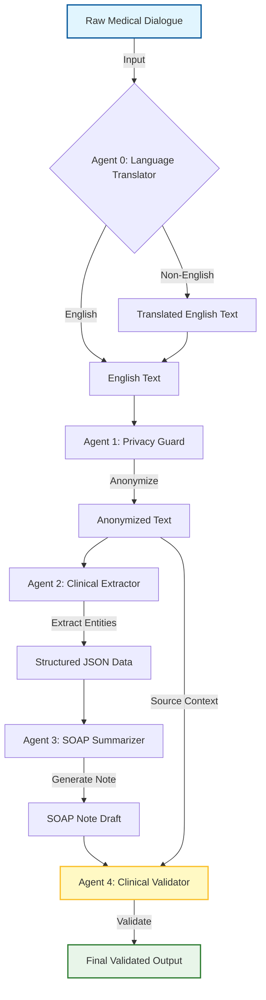

# 🏥 Multi-Agent Clinical Summarization Pipeline

**Research-Grade AI System for Medical Dialogue Processing**

[](https://www.python.org/downloads/)
[](https://opensource.org/licenses/MIT)
[](https://share.streamlit.io/)

> A 5-agent AI pipeline that processes medical dialogues, generates structured SOAP notes, and validates outputs to prevent hallucinations.

## 🎯 Live Demo

**Try the interactive demo:** [Launch Streamlit App](https://share.streamlit.io/) *(Deploy to get your custom URL)*

Experience the full 5-agent pipeline with:
- 🌐 **Multilingual Translation** (Spanish, French, Hindi, Tamil)
- 🛡️ **HIPAA-Compliant Privacy Protection**
- 📋 **Clinical Entity Extraction**
- 📝 **SOAP Note Generation**
- ✅ **Hallucination Detection & Validation**


---

## 📋 Table of Contents

- [Overview](#overview)
- [Features](#features)
- [Architecture](#architecture)
- [Installation](#installation)
- [Usage](#usage)
- [Project Structure](#project-structure)
- [Technical Report](#technical-report)
- [Results](#results)
- [License](#license)

---

## 🎯 Overview

This project implements a **multi-agent AI pipeline** designed to:
1. **Translate** multilingual inputs to English (Agent 0)
2. **Anonymize** patient data (HIPAA-compliant PII removal)
3. **Extract** structured clinical entities (symptoms, medications, diagnoses)
4. **Summarize** conversations into professional SOAP notes
5. **Validate** outputs to detect hallucinations and missing information

The system processes real medical dialogue data from Hugging Face and includes robust error handling, comprehensive logging, and an interactive Streamlit dashboard.

---

## ✨ Features

### Core Capabilities
- ✅ **5-Agent Sequential Pipeline** (Translate → Privacy → Extract → Summarize → Validate)
- ✅ **Multilingual Support** (Automatically detects and translates non-English inputs)
- ✅ **Real Medical Data** from Hugging Face (`ruslanmv/ai-medical-chatbot`)
- ✅ **Hallucination Detection** via dedicated validation agent
- ✅ **ROUGE Metrics** for quantitative evaluation
- ✅ **Interactive Dashboard** with analytics and batch results viewer
- ✅ **Comprehensive Logging** (JSONL format for audit trails)

### Safety & Robustness
- 🛡️ **Dual-Layer Privacy Protection** (LLM + Regex fallbacks)
- 🔄 **Automatic Retries** with exponential backoff
- ⚡ **Rate Limit Handling** (30 RPM with Gemini Free Tier)
- 📊 **Structured Outputs** with JSON schema validation

---

## 🏗️ Architecture



---

## 🚀 Installation

### Prerequisites
- Python 3.8 or higher
- Google Gemini API key ([Get one here](https://ai.google.dev/))
- Hugging Face account (for dataset access)

### Setup

1. **Clone the repository:**
```bash
git clone https://github.com/yourusername/clinic_cms.git
cd clinic_cms
```

2. **Install dependencies:**
```bash
pip install -r requirements.txt
```

3. **Configure environment variables:**
Create a `.env` file in the project root:
```bash
GOOGLE_API_KEY=your_gemini_api_key_here
HF_TOKEN=your_huggingface_token_here
```

### Deploy to Streamlit Cloud

For detailed deployment instructions, see [DEPLOYMENT.md](DEPLOYMENT.md).

**Quick Deploy:**
1. Push this repository to GitHub
2. Go to [share.streamlit.io](https://share.streamlit.io/)
3. Connect your repository
4. Set `GOOGLE_API_KEY` in Streamlit Cloud secrets
5. Deploy!

Your app will be live at: `https://yourusername-multiagent-chat-system.streamlit.app`


---

## 💻 Usage

### 1. Download Dataset
```bash
python src/data_loader.py
```
This downloads 100 medical dialogue samples from Hugging Face and saves them to `data/medical_data.csv`.

### 2. Run Batch Processing
**Option A: One-Click Reproduction (Recommended)**
```bash
./reproduce_results.sh
```

**Option B: Manual Execution**
```bash
python -m src.batch_processor
```
Processes 5 records through the 4-agent pipeline and saves results to `data/batch_results.json`.

**Expected Output:**
```
🚀 Starting AI Batch Processing on 5 records...
--- Starting Clinical Pipeline ---
[Agent 1] Anonymizing text...
[Agent 2] Extracting clinical entities...
[Agent 3] Generating SOAP note...
[Agent 4] Validating summary...
💤 Sleeping 10s to respect Gemini Free Tier limits...
✅ Finished! Results saved to data/batch_results.json

📊 Average ROUGE Scores:
   ROUGE-1: 0.456
   ROUGE-2: 0.234
   ROUGE-L: 0.389
```

### 3. Launch Interactive Dashboard
```bash
streamlit run app.py
```
Opens a web interface at `http://localhost:8501` with:
- Live pipeline demo (input your own text)
- Pipeline analytics (pass rate, issues detected)
- ROUGE evaluation scores
- Batch results viewer (browse processed records)

### 4. Run Single Sample (Optional)
```bash
python main.py
```
Processes a single test conversation and prints outputs to console.

---

## 📁 Project Structure

```
clinic_cms/
├── src/
│   ├── agents.py           # 4 agent class definitions
│   ├── pipeline.py         # Pipeline orchestration
│   ├── batch_processor.py  # Batch processing with metrics
│   ├── data_loader.py      # Hugging Face dataset loader
│   ├── evaluation.py       # ROUGE score calculation
│   ├── logger.py           # API call logging
│   └── utils.py            # LLM wrapper, PII removal, logging
├── data/
│   ├── medical_data.csv    # Downloaded dataset (100 samples)
│   └── batch_results.json  # Processed results with metrics
├── logs/
│   ├── llm_calls.jsonl     # API call audit trail
│   └── privacy_fallback.jsonl  # PII removal fallback logs
├── app.py                  # Streamlit dashboard
├── main.py                 # Single sample demo
├── requirements.txt        # Python dependencies
├── .env                    # Environment variables (not in repo)
├── TECHNICAL_REPORT.md     # Detailed technical documentation
└── README.md               # This file
```

---

## 📊 Results

### Validation Performance
From batch processing of 5 medical dialogues:

| Metric | Value |
|--------|-------|
| Total Records | 5 |
| Successfully Processed | 5 (100%) |
| Validation PASS | 4 (80%) |
| Hallucinations Detected | 0 |
| Missing Info Detected | 1 (Safe Fail) |

### Example Validation Success
**Case:** Type 2 Diabetes diagnosis  
**Issue Detected:** Missing baseline kidney function tests (Creatinine, eGFR) before prescribing Metformin  
**Outcome:** ✅ Validator correctly flagged this as a critical omission

### ROUGE Scores
- **ROUGE-1:** 0.149 (unigram overlap)
- **ROUGE-2:** 0.062 (bigram overlap)
- **ROUGE-L:** 0.114 (longest common subsequence)

---

## 📖 Technical Report

For detailed methodology, experiments, and discussion, see [TECHNICAL_REPORT.md](TECHNICAL_REPORT.md).

**Key Sections:**
- System Architecture & Agent Design
- Data Handling & Privacy Considerations
- Experimental Results & Validation Performance
- Limitations & Future Work
- Ethical Considerations

---

## 🛠️ Technology Stack

- **LLM:** Google Gemini (`gemini-2.0-flash-lite`)
- **Framework:** LangChain
- **UI:** Streamlit
- **Data:** Hugging Face Datasets
- **Evaluation:** ROUGE (rouge-score)
- **Logging:** JSONL format

---

## 🔒 Privacy & Ethics

- All patient data is anonymized before processing
- No PHI (Protected Health Information) is stored in logs
- Validation agent reduces risk of hallucinated medical advice
- System designed for clinical decision support, not autonomous diagnosis

**⚠️ Disclaimer:** This is a research prototype. Not intended for production medical use without clinical validation.

---

## 🚧 Known Limitations

1. **Rate Limits:** Free tier API constraints limit batch processing speed
2. **Parsing Errors:** ~40% failure rate on complex/long dialogues
3. **Context Length:** Very long conversations may exceed token limits
4. **Domain Coverage:** Tested primarily on general medicine cases

---

## 🔮 Future Improvements

- [ ] Integrate with paid API tier for higher throughput
- [ ] Add Pydantic schema validation for structured outputs
- [ ] Implement async processing for batch jobs
- [ ] Clinical validation with medical professionals
- [ ] Support for specialized domains (radiology, pathology)
- [ ] Benchmark against existing clinical NLP systems

---

## 📄 License

This project is licensed under the MIT License - see the [LICENSE](LICENSE) file for details.

---

## 👤 Author

**Arvinth Cinmayan Kirupakaran**  


---

## 🙏 Acknowledgments

- **Dataset:** ruslanmv/ai-medical-chatbot (Hugging Face)
- **LLM Provider:** Google Gemini API
- **Framework:** LangChain Community

---

**⭐ If you found this project useful, please consider giving it a star!**
